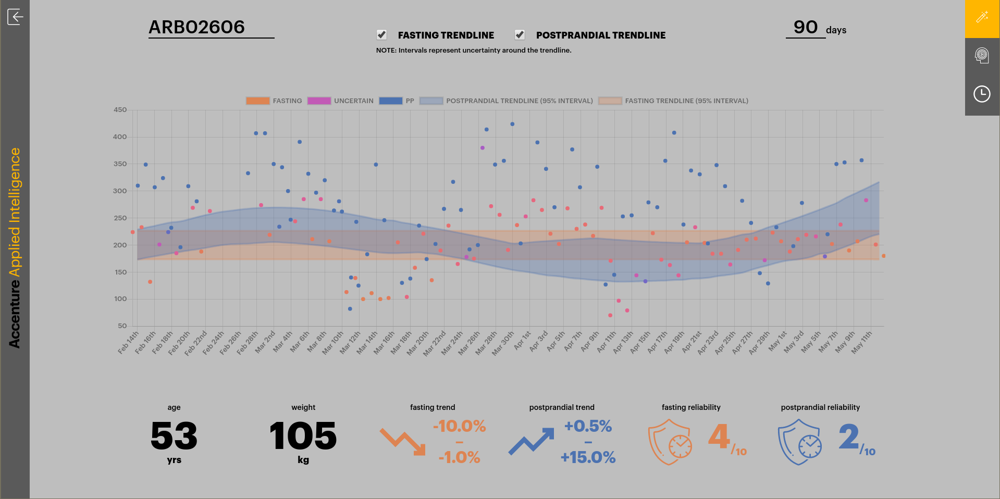
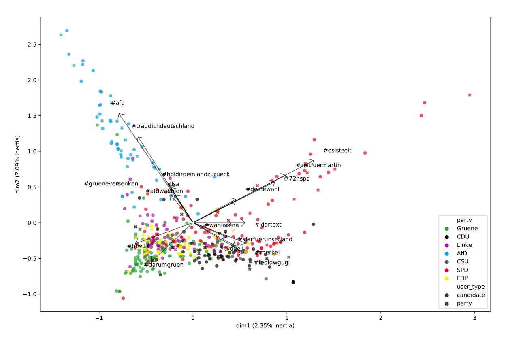

# Main Header:

We rethink what companies do

## Kannact + Accenture

Many healthcare institutions are now trying to work with patient-generated data from at-home devices and mobile applications. Recovering accurate measures of patient health from this noisy data with honest uncertainty quantification, however, is a statistical challenge many companies and research institutions are failing. Kannact, a healthcare technology startup in the US focused on population management of diabetes and other chronic patients, approached the Data Science Center for help in smarter usage of their patient-generated data to help coach their diabetes patients. We teamed up with Accenture's Applied Intelligence unit to develop a solution that solved the core problem we saw with Kannact's workflow: accurately inferring the type of glucose reading from partially-labelled data and modelling medium-term trends in disease evolution to assess program effectiveness.

## Reuters Institute @ Oxford

Nobody doubts the importance of Twitter in influencing the outcome of elections. Understanding exactly how that influence is exerted, and by whom, is the question that the Reuters Institute for the Study of Journalism at Oxford University wanted to answer. They approached the Center for help in both collecting tens of millions of tweets during elections around the world, as well as analysing the content and interactions of the users. Together, we developed novel statistical methods for measuring engagement effectiveness of individuals and parties and mapped the topics of conversation into several dimensions to examine similarity and differences between parties.

## Accenture

Accenture's Applied Intelligence unit approached the Data Science Center with a challenge to come up with a new solution for predictive interventin in hospital resource allocation. Applying cutting-edge machine-learning methods in causal modelling, we developed a dashboard that allows hospital managers to see the effect of intervening and increasing resources in any given hospital unit, taking into account the complex interactions of patient flows and wait times between units.
